# Typora简介

Typora是一个所见即所得的Markdown格式文本编辑器，支持Windows、macOS和GNU/Linux操作系统，拼写检查、自定义CSS样式、数学公式渲染（通过MathJax）等特性。

如果你还不知道`Typora`，请访问[Typora — a markdown editor, markdown reader.](https://typora.io/)

 

# 主题安装方法

1. 下载本主题的压缩文件[Latest release](https://github.com/AntonVanke/typora-mlike-theme/releases/latest)
2. 打开`Typora`, 点击菜单栏的`偏好设置`-`外观`-`打开主题文件夹`
3. 将`解压后的`文件复制到主题文件夹下(压缩包包含`mlike`文件夹、 `mlike.css` `mlike-light.css`、`mlike-dark.css`)
4. 重新启动`Typora`，点击菜单栏的`主题`-`Mlike Light`或者`Mlike Dark`

具体的安装方法可查看 [Install Theme (typora.io)](https://theme.typora.io/doc/Install-Theme/)

 

# Typora Themes 

下面15个主题是大邓最喜欢的主题
1. Autumnus
2. Adark
3. Drake
4. FluentLight
5. Jamstatic
6. LessLight
7. LessLightPrint
8. Mo
9. NewPrint
10. OptAutumnus
11. OrangeHeart
12. PixII
13. Torillic
14. Vue
15. Whitey

## 1.Autumnus

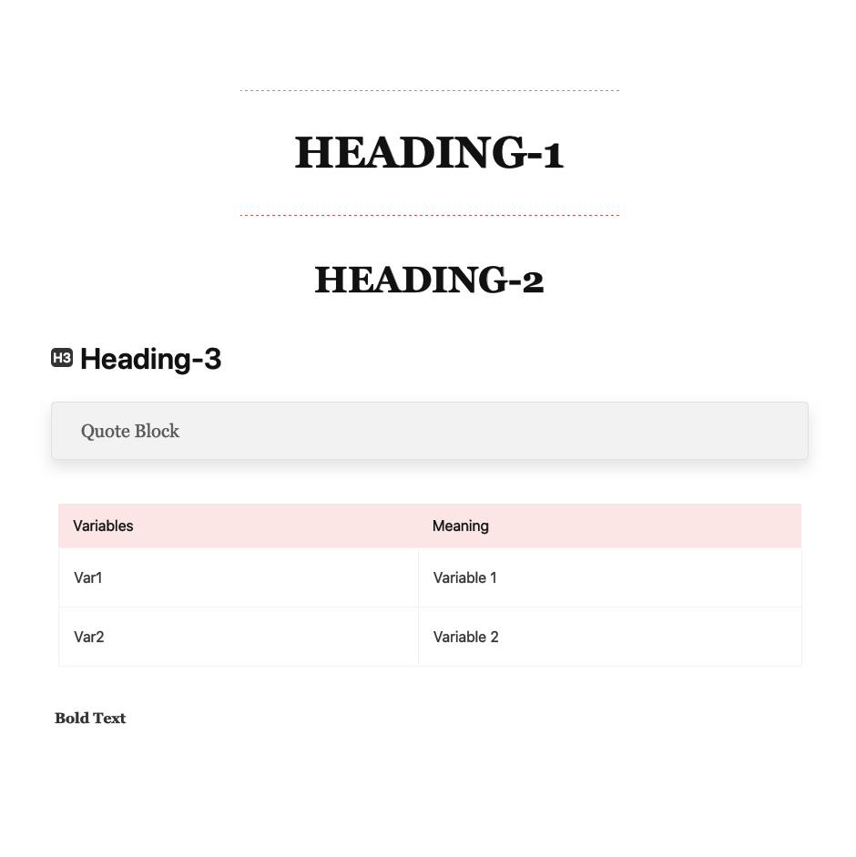

 

## 2.Adark

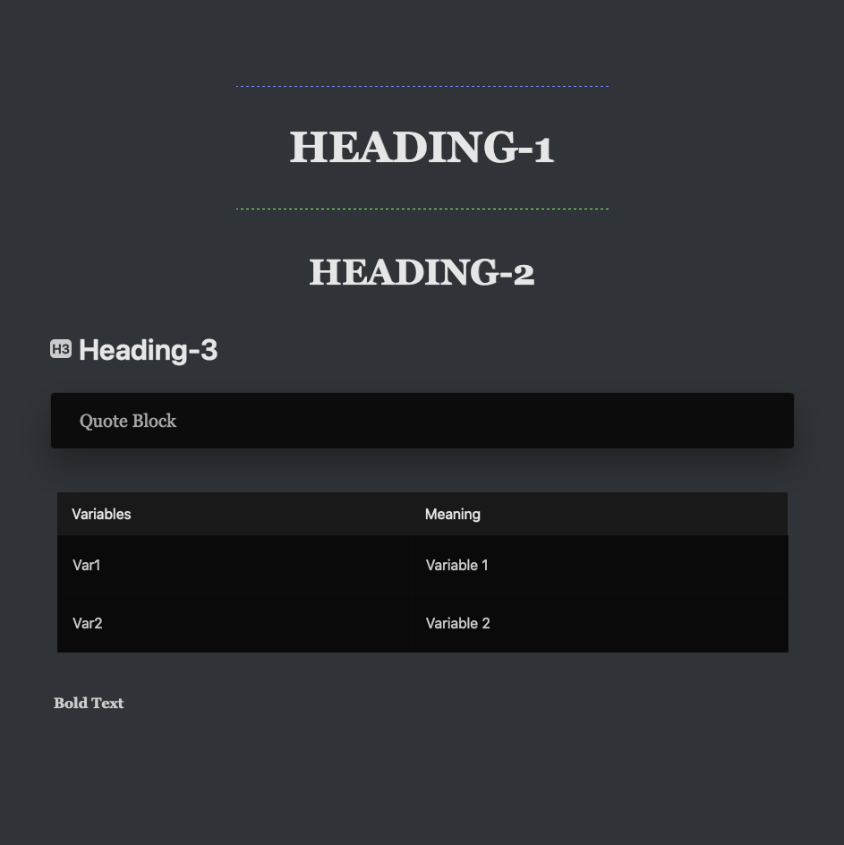

 

## 3.Drake

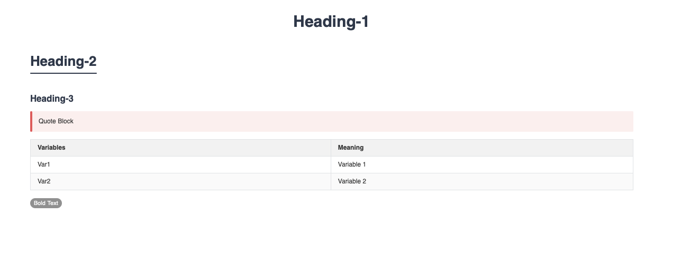

 

## 4.FluentLight

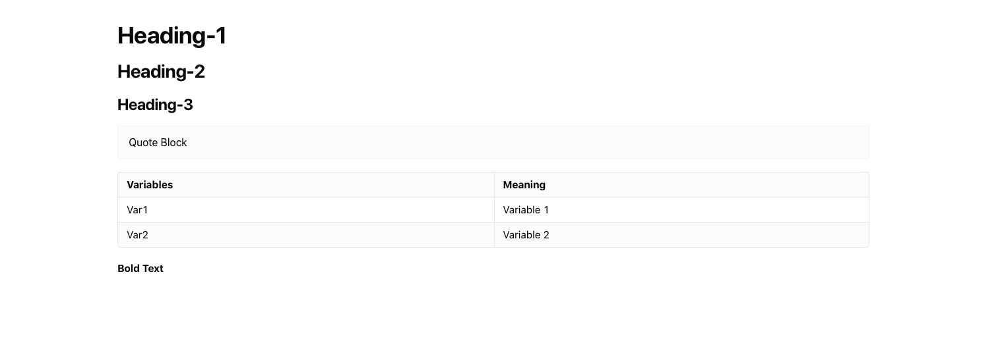

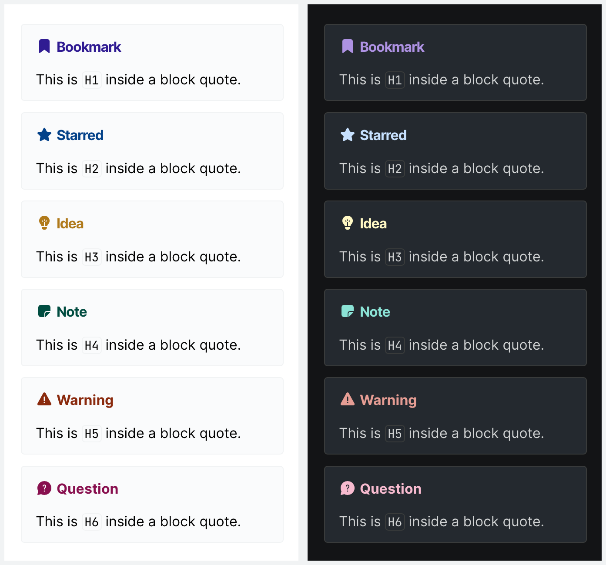

 

## 5.Jamstatic

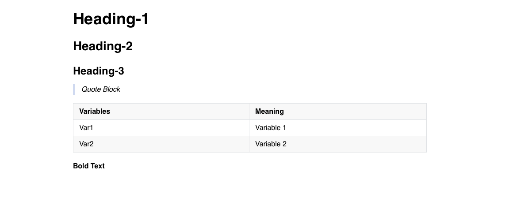

 

## 6.LessLight

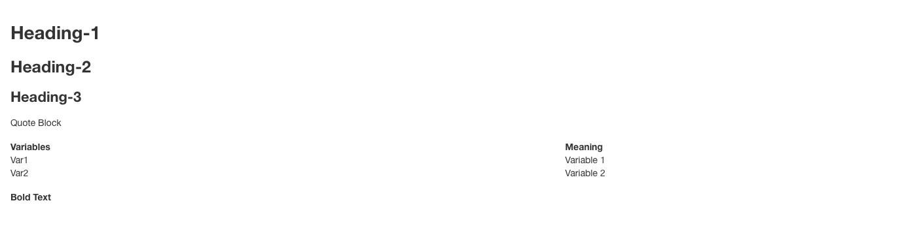

 

## 7.LessLightPrint

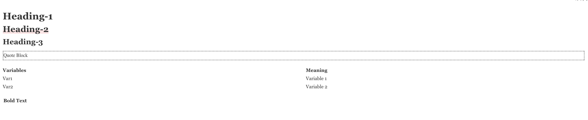

 

## 8.Mo

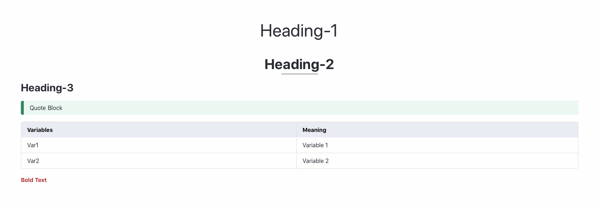

 

## 9.NewPrint

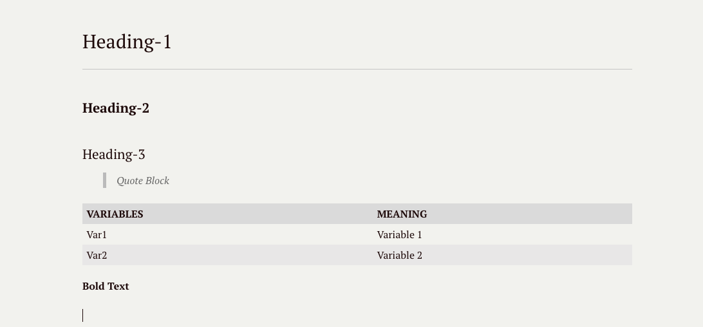

 

## 10.OptAutumnus

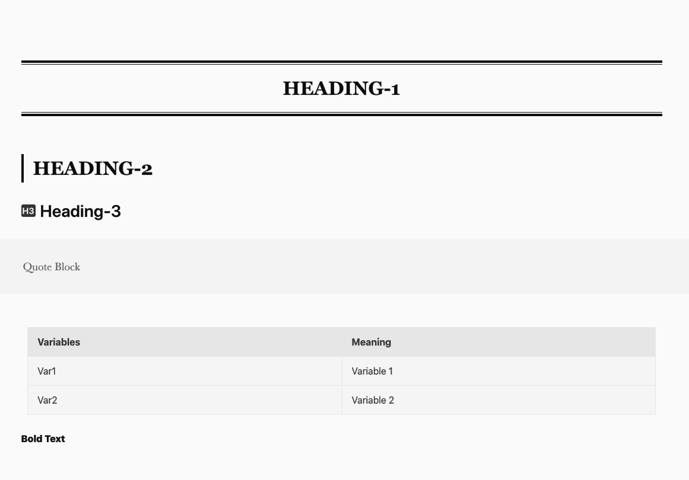

 

## 11.OrangeHeart

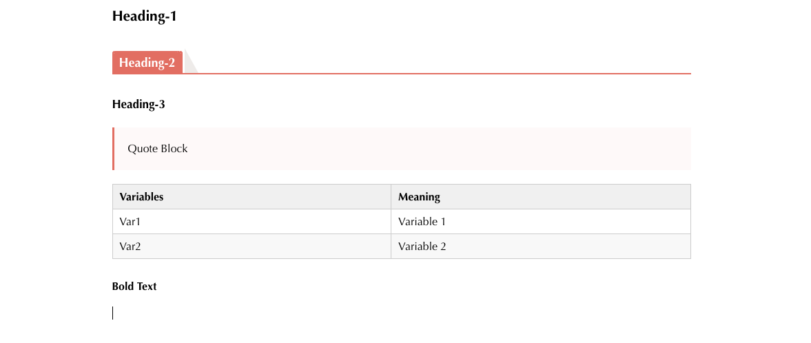

 

## 12.PixII

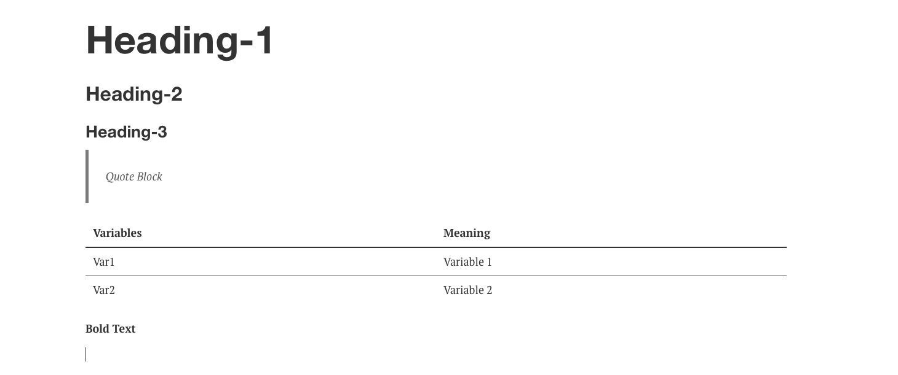

 

## 13.Torillic

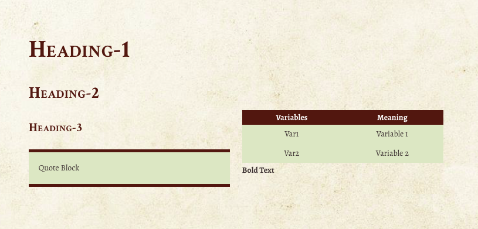

 

## 14.Vue

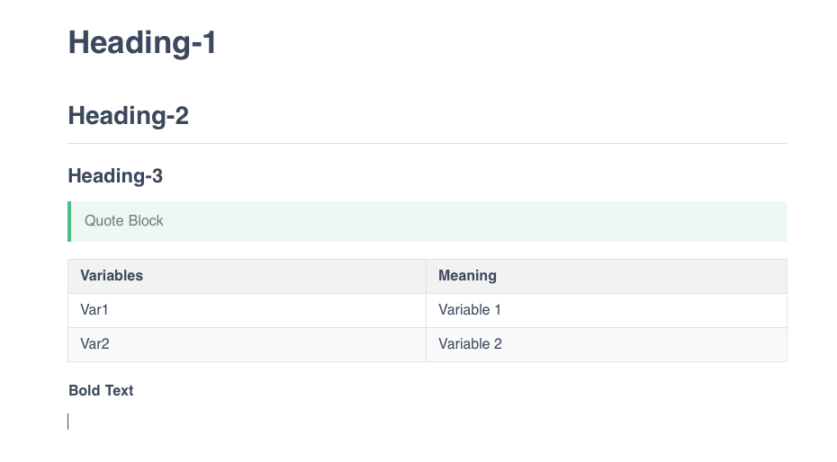

 

## 15.Whitey

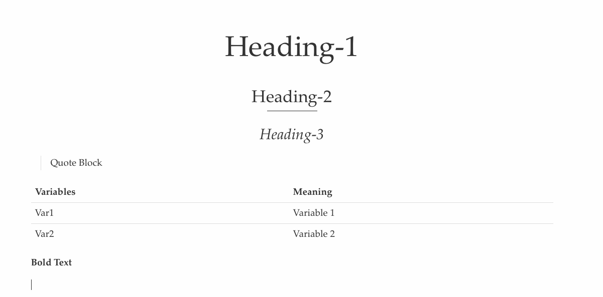

 
